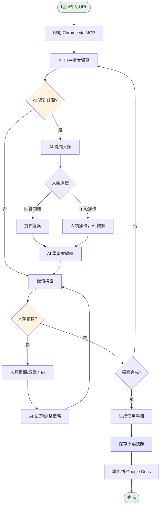
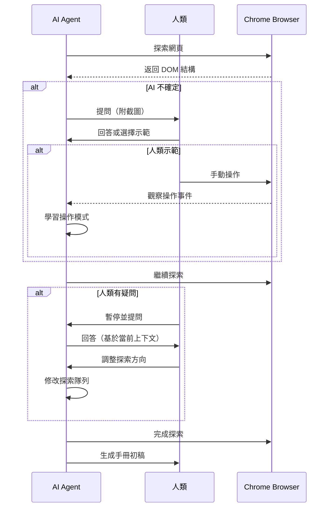
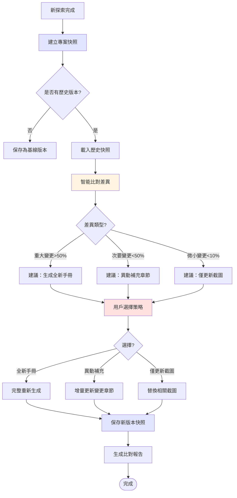
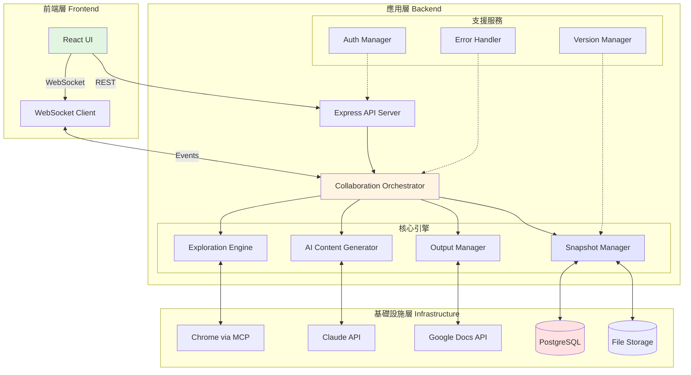
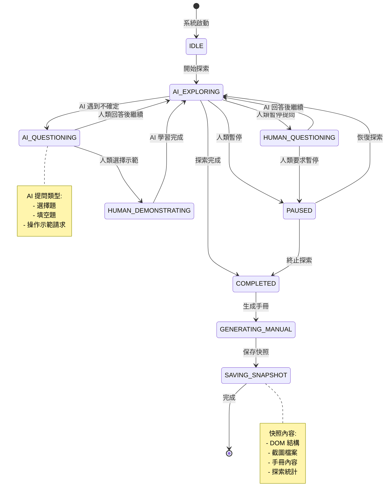
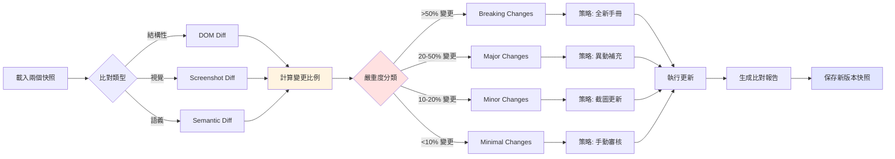

# Story 1.0: AutoDoc Agent - 智能探索式使用手冊生成器

## Story Description

AutoDoc Agent 是一個基於 AI 的自動化使用手冊生成系統，透過 Chrome DevTools MCP 實現智能網頁探索與雙向協作學習。系統只需輸入產品入口 URL，AI 即可自主探索網頁結構、截圖並生成使用手冊初稿。核心特色是「雙向學習」：AI 遇到疑問時可請人類示範操作並觀察學習；人類在監控過程中可隨時暫停提問，與 AI 互動後調整探索方向。最終輸出為 Google Docs 格式（支援修訂模式），實現人機協作編輯。

**核心價值**：
- 🚀 零配置啟動：只需輸入 URL，無需預先定義網站結構
- 🤝 雙向學習：AI 與人類互為師徒，共同探索未知介面
- 👁️ 實時監控：人類可觀察 AI 的每一步操作並隨時介入
- 💾 專案存檔：完整保存探索快照，支援版本比對與差異分析
- 🔄 智能更新：檢測介面變更，可生成全新手冊或異動補充章節
- 🏢 多機種管理：支援不同產品版本的獨立手冊維護

### 系統工作流程



### 雙向協作循環



---

## Tasks

### Task 1: Chrome DevTools MCP 整合與瀏覽器控制核心

**目標**：建立與 Chrome DevTools Protocol 的穩定連線，實現頁面導航、DOM 分析、截圖等基礎能力。

- [ ] **Subtask 1.1**: 設計 Chrome MCP Server 連線管理器 (`src/browser/mcp_connector.ts`)
  - 實作 MCP 協定的 WebSocket 連線建立與心跳保持
  - 實作連線斷線重連機制（最多 3 次重試，指數退避）
  - 實作並發請求管理（支援同時發送多個 CDP 命令）
  - 錯誤處理：連線失敗拋出 `MCPConnectionError`

- [ ] **Subtask 1.2**: 封裝 Chrome DevTools Protocol 核心命令 (`src/browser/cdp_wrapper.ts`)
  - 封裝 `Page.navigate(url)` - 導航到指定 URL
  - 封裝 `Page.captureScreenshot(format, quality)` - 截圖（PNG/JPEG）
  - 封裝 `DOM.getDocument()` - 獲取完整 DOM 樹
  - 封裝 `DOM.querySelectorAll(selector)` - CSS 選擇器查詢
  - 封裝 `Runtime.evaluate(expression)` - 執行 JavaScript 代碼
  - 封裝 `Network.enable()` / `Network.requestWillBeSent` - 網路監控
  - 所有命令都包含超時處理（預設 30 秒）

- [ ] **Subtask 1.3**: 實作頁面狀態檢測器 (`src/browser/page_state_detector.ts`)
  - 實作 `waitForNetworkIdle()` - 等待網路請求完成（2 秒內無新請求）
  - 實作 `waitForDOMStable()` - 等待 DOM 結構穩定（500ms 內無變化）
  - 實作 `detectModalDialog()` - 檢測彈出視窗或對話框
  - 實作 `detectLoadingIndicator()` - 檢測載入中指示器（spinner/skeleton）
  - 支援自定義等待條件（傳入 JavaScript 表達式）

- [ ] **Subtask 1.4**: 建立瀏覽器生命週期管理 (`src/browser/browser_manager.ts`)
  - 實作 `launchBrowser(headless, viewport)` - 啟動 Chrome 實例
  - 實作 `createPage()` / `closePage()` - 頁面（標籤頁）管理
  - 實作 `setViewport(width, height)` - 設定視窗大小（預設 1920x1080）
  - 實作 `enableCookies()` / `setCookies()` - Cookie 管理（支援登入狀態保持）
  - 實作資源清理邏輯（graceful shutdown）

---

### Task 2: 智能網頁結構探索引擎

**目標**：自動分析網頁 DOM 結構，識別可操作元素，建立探索計劃並執行。

- [ ] **Subtask 2.1**: 開發 DOM 結構分析器 (`src/explorer/dom_analyzer.ts`)
  - 實作 `extractInteractiveElements()` - 提取所有可互動元素
    - 識別 buttons, links, tabs, dropdowns, inputs
    - 提取元素的文字標籤、CSS 選擇器、位置坐標
    - 計算元素的「重要性分數」（基於標籤、位置、語義）
  - 實作 `extractNavigationStructure()` - 識別導航結構
    - 識別側邊欄、頂部選單、麵包屑導航
    - 建立導航樹狀結構（parent-child 關係）
  - 實作 `extractForms()` - 識別表單與輸入欄位
    - 提取 form, input, select, textarea 元素
    - 識別必填欄位、驗證規則（從 HTML attributes）
  - 處理 Shadow DOM 和 iframe 內的元素

- [ ] **Subtask 2.2**: 設計探索策略引擎 (`src/explorer/exploration_strategy.ts`)
  - 實作 `buildExplorationQueue(structure)` - 建立探索隊列
    - 支援 BFS（廣度優先）和 DFS（深度優先）策略
    - 預設使用「重要性優先」策略（高分元素優先）
  - 實作 `calculatePriority(element)` - 計算探索優先級
    - 基於元素類型、文字語義、位置等因素
    - 優先探索：設定、管理、配置類功能
  - 實作 `detectDuplicates(element)` - 避免重複探索
    - 基於 URL、DOM 結構相似度判斷
  - 實作探索深度限制（預設最多 5 層）

- [ ] **Subtask 2.3**: 實作探索執行器 (`src/explorer/exploration_executor.ts`)
  - 實作 `exploreElement(element)` - 執行單個元素的探索
    - 滾動到元素可見位置
    - 點擊元素並等待頁面穩定
    - 截圖並記錄變化
  - 實作 `handleFormInteraction(form)` - 處理表單互動
    - 智能填寫測試資料（支援自定義資料集）
    - 提交表單並捕捉結果
  - 實作錯誤恢復機制
    - 檢測 404、500 錯誤頁面
    - 自動回到上一頁繼續探索
  - 實作探索狀態保存（支援中斷恢復）

- [ ] **Subtask 2.4**: 開發探索視覺化模組 (`src/explorer/visualization.ts`)
  - 實作 `generateExplorationTree()` - 生成探索樹狀圖
    - 顯示已探索、正在探索、待探索的節點
    - 標記遇到問題的節點（需人類介入）
  - 實作 `generateProgressStats()` - 統計探索進度
    - 已探索頁面數、發現的功能數、預計剩餘時間
  - 實作實時更新機制（WebSocket 推送到前端）

---

### Task 3: 雙向協作互動系統

**目標**：實現 AI 與人類的雙向學習機制，包括 AI 請求協助、人類暫停提問、觀察學習等功能。

- [ ] **Subtask 3.1**: 設計協作狀態機 (`src/collaboration/state_machine.ts`)
  - 定義狀態：`AI_EXPLORING`, `AI_QUESTIONING`, `HUMAN_DEMONSTRATING`, `HUMAN_QUESTIONING`, `PAUSED`
  - 實作狀態轉換邏輯與驗證
  - 實作狀態持久化（支援會話恢復）

- [ ] **Subtask 3.2**: 實作 AI 提問系統 (`src/collaboration/ai_questioning.ts`)
  - 實作 `detectUncertainty()` - 檢測 AI 的不確定性情況
    - 多個相似元素無法區分（如多個「儲存」按鈕）
    - 不確定元素的作用（語義不明確）
    - 表單欄位不知道該填什麼值
    - 遇到需要認證或特殊權限的頁面
  - 實作 `generateQuestion(context)` - 生成結構化問題
    - 問題類型：選擇題、填空題、操作請求
    - 附帶上下文截圖和元素高亮
  - 實作 `waitForHumanResponse(timeout)` - 等待人類回應
    - 支援超時設定（預設 5 分鐘）
    - 超時後自動暫停探索

- [ ] **Subtask 3.3**: 實作人類操作觀察系統 (`src/collaboration/human_observation.ts`)
  - 實作 `startObservationMode()` - 啟動觀察模式
    - 記錄人類的所有點擊、輸入、滾動操作
    - 使用 Chrome DevTools `Input.dispatchMouseEvent` 等事件捕捉
  - 實作 `analyzeHumanActions(actions)` - 分析人類操作序列
    - 提取關鍵步驟（去除冗餘操作）
    - 識別操作模式（如「點擊 → 等待 → 輸入」）
    - 生成操作摘要（自然語言描述）
  - 實作 `learnFromDemonstration(actions)` - 從示範中學習
    - 更新探索策略（新增相似元素到高優先級）
    - 記錄到知識庫（下次遇到相似情況自動處理）
  - 實作 `takebackControl()` - AI 重新接管控制權

- [ ] **Subtask 3.4**: 實作人類提問與暫停系統 (`src/collaboration/human_questioning.ts`)
  - 實作 `pauseExploration()` - 暫停 AI 探索
    - 保存當前狀態（頁面 URL、探索隊列、已收集資料）
    - 凍結瀏覽器操作（防止自動跳轉）
  - 實作 `handleHumanQuestion(question)` - 處理人類提問
    - 使用 Claude API 回答問題
    - 提供當前上下文（截圖、DOM 結構、已探索路徑）
  - 實作 `adjustExplorationDirection(feedback)` - 調整探索方向
    - 支援指令：「跳過這個區域」、「重點探索 XXX」、「改變探索順序」
    - 動態修改探索隊列
  - 實作 `resumeExploration()` - 恢復探索

- [ ] **Subtask 3.5**: 建立實時通訊層 (`src/collaboration/realtime_communication.ts`)
  - 實作 WebSocket Server（用於前端實時更新）
  - 實作事件發布訂閱系統
    - 事件類型：`ai_question`, `human_answer`, `exploration_progress`, `state_change`
  - 實作訊息序列化與反序列化
  - 實作連線管理與斷線重連

---

### Task 4: AI 內容理解與生成引擎

**目標**：使用 Claude Vision API 理解截圖內容，生成結構化的使用手冊文字。

- [ ] **Subtask 4.1**: 整合 Claude Vision API (`src/ai/claude_vision_client.ts`)
  - 實作 `analyzeScreenshot(image, context)` - 分析截圖
    - 將截圖轉換為 base64 格式
    - 調用 Claude API (model: claude-sonnet-4-20250514)
    - 傳入上下文：當前頁面 URL、導航路徑、用戶操作歷史
  - 實作 prompt 模板系統
    - 功能描述 prompt：「這個頁面的主要功能是什麼？」
    - 步驟提取 prompt：「如何使用這個功能？請列出操作步驟」
    - UI 元素識別 prompt：「截圖中的按鈕和輸入框分別是什麼作用？」
  - 實作重試機制與錯誤處理
    - API 失敗時重試 3 次
    - 超時設定為 60 秒

- [ ] **Subtask 4.2**: 開發內容結構化引擎 (`src/ai/content_structurer.ts`)
  - 實作 `extractFunctionality(analysis)` - 提取功能描述
    - 解析 Claude 回應的 JSON 結構
    - 提取：功能名稱、用途、前置條件、操作步驟、預期結果
  - 實作 `generateStepByStepGuide(actions)` - 生成分步指南
    - 格式化操作步驟（1. 2. 3. ...）
    - 標記關鍵元素（用粗體或顏色標記）
    - 附加截圖編號（圖 1、圖 2...）
  - 實作 `detectWarningsAndNotes(analysis)` - 識別警告與注意事項
    - 關鍵字檢測：「注意」、「警告」、「錯誤」、「不可逆」
    - 自動生成警告框樣式

- [ ] **Subtask 4.3**: 實作內容去重與合併 (`src/ai/content_deduplication.ts`)
  - 實作 `detectDuplicateContent(contents)` - 檢測重複內容
    - 使用語義相似度計算（embeddings）
    - 閾值設定：相似度 > 0.9 視為重複
  - 實作 `mergeRelatedSections(sections)` - 合併相關章節
    - 識別相同功能的不同入口（如「新增用戶」可從多個頁面進入）
    - 合併為單一章節，標記多種操作路徑
  - 實作 `optimizeContentHierarchy(manual)` - 優化內容層級
    - 自動調整章節層級（H1, H2, H3...）
    - 生成目錄（Table of Contents）

- [ ] **Subtask 4.4**: 建立專業術語管理 (`src/ai/terminology_manager.ts`)
  - 實作 `extractTerminology(content)` - 提取產品專業術語
    - 識別產品特定的專有名詞
    - 建立術語表（Term → Definition）
  - 實作 `ensureConsistency(manual)` - 確保術語一致性
    - 統一同義詞（如「伺服器」vs「服務器」）
    - 自動替換不一致的用詞
  - 實作 `generateGlossary()` - 生成術語表附錄

---

### Task 5: Google Docs 整合與協作編輯

**目標**：將生成的內容輸出到 Google Docs，支援修訂模式（Suggestion Mode）讓人類審核。

- [ ] **Subtask 5.1**: 整合 Google Docs API (`src/output/google_docs_client.ts`)
  - 實作 OAuth 2.0 認證流程
    - 使用服務帳號或用戶授權
    - Token 自動刷新機制
  - 實作 `createDocument(title)` - 建立新文檔
  - 實作 `shareDocument(docId, emails, role)` - 分享文檔
    - 支援角色：viewer, commenter, editor
  - 實作錯誤處理（API 配額超限、權限不足等）

- [ ] **Subtask 5.2**: 實作內容寫入器 (`src/output/docs_content_writer.ts`)
  - 實作 `insertText(docId, text, position, suggestionMode)` - 插入文字
    - 支援修訂模式（人類需審核）或直接模式
  - 實作 `insertImage(docId, imageUrl, position, caption)` - 插入圖片
    - 上傳截圖到 Google Drive
    - 插入圖片並添加標題
  - 實作 `applyFormatting(docId, range, style)` - 套用格式
    - 支援：粗體、斜體、標題層級、項目符號、編號列表
  - 實作 `createTableOfContents(docId)` - 生成目錄
    - 自動偵測標題並建立連結

- [ ] **Subtask 5.3**: 開發批次操作優化 (`src/output/batch_operations.ts`)
  - 實作 `batchRequests(requests)` - 批次 API 請求
    - 將多個小請求合併為單一 batchUpdate
    - 減少 API 調用次數（Google Docs API 有配額限制）
  - 實作請求隊列管理
    - 控制並發請求數（最多 10 個並行）
    - 失敗請求自動重試

- [ ] **Subtask 5.4**: 實作增量更新機制 (`src/output/incremental_updater.ts`)
  - 實作 `compareWithExisting(docId, newContent)` - 對比舊版內容
    - 使用 diff 演算法識別變更
    - 標記：新增、修改、刪除的段落
  - 實作 `suggestChanges(docId, changes)` - 提出修訂建議
    - 以修訂模式插入變更（人類可接受或拒絕）
  - 實作 `highlightChanges()` - 高亮變更區域
    - 新增內容用綠色標記
    - 修改內容用黃色標記
    - 刪除內容用刪除線

---

### Task 6: 前端監控介面（Web UI）

**目標**：提供視覺化的實時監控介面，讓人類觀察 AI 探索過程並進行互動。

- [ ] **Subtask 6.1**: 設計前端架構 (`frontend/src/`)
  - 技術棧：React + TypeScript + Tailwind CSS
  - 狀態管理：Zustand 或 Redux
  - 實時通訊：WebSocket 客戶端
  - 路由：React Router

- [ ] **Subtask 6.2**: 實作瀏覽器預覽組件 (`frontend/src/components/BrowserPreview.tsx`)
  - 顯示 AI 正在操作的頁面（實時截圖流）
    - 使用 WebSocket 接收截圖數據
    - 每 500ms 更新一次
  - 高亮當前正在操作的元素（紅框標記）
  - 顯示當前頁面 URL 和標題
  - 支援縮放、全螢幕查看

- [ ] **Subtask 6.3**: 開發探索進度視覺化 (`frontend/src/components/ExplorationProgress.tsx`)
  - 顯示探索樹狀圖（D3.js 或 React Flow）
    - 節點樣式：✅ 已完成、🔄 進行中、⏳ 待探索、❌ 遇到問題
    - 可點擊節點查看詳細資訊
  - 顯示統計數據
    - 已探索頁面數 / 預估總頁面數
    - 已生成章節數
    - 預計剩餘時間
  - 進度條動畫

- [ ] **Subtask 6.4**: 實作互動對話框 (`frontend/src/components/InteractionPanel.tsx`)
  - **AI 提問區域**
    - 顯示 AI 的問題（帶上下文截圖）
    - 提供回答輸入框（文字或選擇題）
    - 按鈕：「開始示範」（人類接管操作）、「跳過」、「標記為未知」
  - **人類提問區域**
    - 輸入框：輸入問題
    - 按鈕：「暫停 AI」、「發送問題」
    - 顯示 AI 的回答（支援 Markdown 渲染）
  - 聊天記錄（保留完整對話歷史）

- [ ] **Subtask 6.5**: 建立控制台 (`frontend/src/components/ControlPanel.tsx`)
  - 輸入區域：入口 URL、探索深度、策略選擇
  - 控制按鈕：
    - 「開始探索」、「暫停」、「繼續」、「停止」
    - 「調整方向」（開啟設定對話框）
    - 「匯出手冊」（下載 Google Docs 連結）
  - 設定面板：
    - 探索策略（BFS/DFS/智能優先）
    - 截圖品質（高/中/低）
    - Google Docs 設定（文檔標題、分享對象）
    - 認證資訊（登入憑證、Cookie）

- [ ] **Subtask 6.6**: 實作即時日誌與除錯工具 (`frontend/src/components/LogViewer.tsx`)
  - 顯示結構化日誌（info, warning, error 等級）
  - 支援日誌過濾與搜尋
  - 顯示網路請求記錄（可選）
  - 匯出日誌功能（TXT/JSON 格式）

---

### Task 7: 增量更新與版本管理

**目標**：檢測產品介面的變更，自動更新使用手冊中過時的內容。

- [ ] **Subtask 7.1**: 開發介面變更檢測器 (`src/versioning/change_detector.ts`)
  - 實作 `captureBaseline(url)` - 捕捉基線版本
    - 儲存完整的 DOM 結構快照
    - 儲存所有頁面的截圖
    - 儲存探索路徑與元素位置
  - 實作 `compareWithBaseline(currentState, baseline)` - 對比檢測
    - DOM 結構對比（新增/刪除/修改的元素）
    - 截圖視覺對比（使用圖像差異演算法）
    - 功能清單對比（基於元素語義）
  - 實作 `generateChangeReport()` - 生成變更報告
    - 列出所有檢測到的變更
    - 分類：重大變更、次要變更、外觀變更
    - 標記受影響的手冊章節

- [ ] **Subtask 7.2**: 實作智能更新決策引擎 (`src/versioning/update_decision_engine.ts`)
  - 實作 `classifyChange(change)` - 分類變更類型
    - 功能新增：需新增章節
    - 功能移除：需刪除或標記章節
    - 介面調整：需更新截圖和描述
    - 文字變更：需更新元素標籤
  - 實作 `prioritizeUpdates(changes)` - 優先級排序
    - 高優先級：影響核心功能的變更
    - 中優先級：次要功能或 UI 調整
    - 低優先級：純外觀變更（顏色、字體）
  - 實作 `generateUpdatePlan(changes)` - 生成更新計劃
    - 列出需重新探索的頁面
    - 列出需更新的手冊章節
    - 預估更新時間

- [ ] **Subtask 7.3**: 開發增量更新執行器 (`src/versioning/incremental_executor.ts`)
  - 實作 `executeUpdatePlan(plan)` - 執行更新計劃
    - 只重新探索變更的頁面
    - 保留未變更部分的內容
  - 實作 `mergeWithExisting(newContent, existingDoc)` - 合併新舊內容
    - 在 Google Docs 中以修訂模式插入變更
    - 保留人類已審核通過的內容
  - 實作版本標記機制
    - 在手冊中標記「最後更新日期」
    - 記錄每次更新的變更摘要

- [ ] **Subtask 7.4**: 建立版本歷史管理 (`src/versioning/version_history.ts`)
  - 實作版本快照儲存（PostgreSQL 或文件系統）
    - 儲存每個版本的 DOM 快照、截圖、生成的手冊
  - 實作版本對比功能
    - 支援選擇任意兩個版本進行對比
  - 實作版本回溯
    - 支援回到歷史版本（用於錯誤恢復）

---

### Task 11: 專案存檔與比對系統

**目標**：完整保存每次探索的快照，支援版本間的智能比對，實現全新手冊生成或異動補充。



- [ ] **Subtask 11.1**: 設計專案快照資料結構 (`src/snapshot/snapshot_schema.ts`)
  - 定義快照資料結構：
    ```typescript
    interface ProjectSnapshot {
      id: string;
      projectName: string;
      version: string; // 如 "1.0.0", "1.1.0"
      entryUrl: string;
      capturedAt: Date;
      metadata: {
        productVersion?: string; // 產品版本號
        variant?: string; // 機種型號
        environment?: string; // 測試/生產環境
        tags: string[]; // 自定義標籤
      };
      explorationData: {
        totalPages: number;
        exploredUrls: string[];
        navigationTree: NavigationNode; // 完整導航樹
        pageSnapshots: PageSnapshot[]; // 每頁的詳細快照
      };
      manualContent: {
        sections: ManualSection[]; // 已生成的手冊章節
        screenshots: ScreenshotMetadata[]; // 所有截圖的元資料
        glossary: TerminologyEntry[]; // 術語表
      };
      statistics: {
        explorationDuration: number; // 秒
        aiQuestionsCount: number;
        humanInterventionsCount: number;
        pagesWithErrors: string[];
      };
    }
    
    interface PageSnapshot {
      url: string;
      title: string;
      domHash: string; // DOM 結構的 hash
      screenshot: {
        url: string; // 儲存位置
        hash: string; // 圖片 hash（用於比對）
        capturedAt: Date;
      };
      interactiveElements: InteractiveElement[];
      formFields: FormField[];
      apiCalls: ApiCall[]; // 頁面載入時的 API 請求
    }
    ```
  - 實作資料驗證與序列化
  - 支援 JSON 和壓縮格式（gzip）

- [ ] **Subtask 11.2**: 實作快照儲存管理器 (`src/snapshot/snapshot_storage.ts`)
  - 實作 `saveSnapshot(snapshot)` - 保存快照
    - 支援多種儲存後端：
      - 本地檔案系統（預設）
      - PostgreSQL（結構化資料）
      - S3/Google Cloud Storage（大型檔案）
    - 自動壓縮大型快照（> 10MB）
    - 生成快照 manifest 檔案
  - 實作 `loadSnapshot(id)` - 載入快照
    - 支援延遲載入（lazy loading）大型資料
    - 自動解壓縮
  - 實作 `listSnapshots(filters)` - 列出快照
    - 支援篩選：專案名稱、版本、日期範圍、標籤
    - 支援排序：日期、版本號
  - 實作 `deleteSnapshot(id)` - 刪除快照
    - 級聯刪除相關的截圖檔案
    - 保留刪除記錄（audit log）
  - 實作快照備份與還原功能

- [ ] **Subtask 11.3**: 開發智能差異檢測引擎 (`src/snapshot/diff_engine.ts`)
  - 實作多層次差異檢測：
    
    **A. 結構性差異（DOM 層級）**
    ```typescript
    interface StructuralDiff {
      addedPages: string[]; // 新增的頁面
      removedPages: string[]; // 移除的頁面
      modifiedPages: {
        url: string;
        changes: {
          addedElements: InteractiveElement[];
          removedElements: InteractiveElement[];
          modifiedElements: {
            element: InteractiveElement;
            changes: string[]; // 變更描述
          }[];
        };
      }[];
    }
    ```
    
    **B. 視覺差異（截圖層級）**
    ```typescript
    interface VisualDiff {
      url: string;
      similarityScore: number; // 0-1，1 為完全相同
      diffImage: Buffer; // 差異標記圖
      changedRegions: {
        x: number;
        y: number;
        width: number;
        height: number;
        severity: 'minor' | 'major' | 'critical';
      }[];
    }
    ```
    - 使用 pixelmatch 演算法比對截圖
    - 忽略微小差異（如動態時間戳、廣告）
    - 可配置敏感度閾值
    
    **C. 語義差異（功能層級）**
    ```typescript
    interface SemanticDiff {
      addedFeatures: Feature[]; // 新增功能
      removedFeatures: Feature[]; // 移除功能
      modifiedFeatures: {
        feature: Feature;
        changes: {
          type: 'text_changed' | 'workflow_changed' | 'ui_redesigned';
          description: string;
          impact: 'low' | 'medium' | 'high';
        }[];
      }[];
    }
    ```
    - 使用 Claude API 分析功能變更
    - 識別重命名（如「新增用戶」改為「建立用戶」）
    - 識別流程變更（如步驟順序調整）
  
  - 實作 `compareSnapshots(oldSnapshot, newSnapshot)` - 執行完整比對
  - 實作變更影響分析（哪些手冊章節需要更新）

- [ ] **Subtask 11.4**: 建立差異分類與策略決策器 (`src/snapshot/update_strategy.ts`)
  - 實作變更嚴重度計算：
    ```typescript
    interface ChangeSeverity {
      structuralChangeRate: number; // 結構變更比例 0-1
      visualChangeRate: number; // 視覺變更比例 0-1
      semanticChangeRate: number; // 語義變更比例 0-1
      overallSeverity: 'minimal' | 'minor' | 'moderate' | 'major' | 'breaking';
    }
    ```
  - 實作策略建議引擎：
    ```typescript
    function recommendStrategy(severity: ChangeSeverity): UpdateStrategy {
      if (severity.overallSeverity === 'breaking' || severity.structuralChangeRate > 0.5) {
        return {
          strategy: 'full_regeneration',
          reason: '重大變更超過 50%，建議完整重新生成手冊',
          estimatedTime: '4-8 小時',
          estimatedCost: '$30-50',
        };
      } else if (severity.overallSeverity === 'major' || severity.structuralChangeRate > 0.2) {
        return {
          strategy: 'incremental_with_new_chapters',
          reason: '新增多個功能，建議增量更新並新增章節',
          affectedChapters: [...],
          estimatedTime: '1-2 小時',
          estimatedCost: '$10-20',
        };
      } else if (severity.visualChangeRate > 0.1) {
        return {
          strategy: 'screenshot_update_only',
          reason: '主要為 UI 視覺調整，建議只更新截圖',
          affectedScreenshots: [...],
          estimatedTime: '30 分鐘',
          estimatedCost: '$5-10',
        };
      } else {
        return {
          strategy: 'minor_text_update',
          reason: '微小文字變更，手動審核即可',
          estimatedTime: '10 分鐘',
          estimatedCost: '$0 (無需 AI)',
        };
      }
    }
    ```
  - 支援自定義策略規則（YAML 配置）
  - 提供多種策略讓用戶選擇

- [ ] **Subtask 11.5**: 實作專案版本管理 (`src/snapshot/version_manager.ts`)
  - 實作語義化版本控制（Semantic Versioning）
    - 自動遞增版本號：
      - Major (1.0.0 → 2.0.0)：breaking changes
      - Minor (1.0.0 → 1.1.0)：新增功能
      - Patch (1.0.0 → 1.0.1)：修正錯誤或微調
  - 實作 `createNewVersion(baseSnapshot, strategy)` - 建立新版本
  - 實作版本標籤系統
    - 支援自定義標籤：如 "stable", "beta", "archived"
  - 實作版本分支管理
    - 支援從任意歷史版本建立新分支
  - 實作版本搜尋與過濾
    - 按版本號範圍搜尋（如 "1.x", ">=2.0.0"）
    - 按日期範圍搜尋
    - 按標籤搜尋

- [ ] **Subtask 11.6**: 開發比對報告生成器 (`src/snapshot/report_generator.ts`)
  - 生成結構化比對報告：
    ```markdown
    # 版本比對報告
    
    ## 基本資訊
    - **比對版本**: v1.0.0 (2025-01-01) vs v1.1.0 (2025-02-01)
    - **專案名稱**: Server Management Console
    - **產品版本**: Model A
    
    ## 變更摘要
    - **新增頁面**: 3 個
    - **移除頁面**: 1 個
    - **修改頁面**: 5 個
    - **新增功能**: 2 個
    - **移除功能**: 0 個
    - **UI 變更**: 8 處
    
    ## 詳細變更清單
    
    ### 新增功能
    1. **用戶批次匯入** (新增)
       - 位置: 用戶管理 > 批次操作
       - 影響章節: 第 3.2 節
       - 建議: 新增子章節
    
    ### 修改功能
    1. **網路設定介面** (重新設計)
       - 變更類型: UI 重新設計
       - 變更描述: 從表格佈局改為卡片佈局
       - 影響章節: 第 5.1 節
       - 建議: 更新截圖和操作步驟
    
    ## 更新策略建議
    - **推薦策略**: 增量更新 + 新增章節
    - **預估時間**: 1-2 小時
    - **預估成本**: $10-20
    
    ## 受影響的手冊章節
    - 第 3.2 節：用戶管理 (新增子章節)
    - 第 5.1 節：網路設定 (更新截圖)
    - 第 7.3 節：批次操作 (新增章節)
    ```
  - 支援多種輸出格式：Markdown, PDF, HTML
  - 包含變更前後的截圖對比
  - 生成變更時間線（Timeline）
  - 支援匯出為 CSV（供 Excel 分析）

- [ ] **Subtask 11.7**: 建立專案管理 UI (`frontend/src/components/ProjectManager.tsx`)
  - **快照列表視圖**
    - 顯示所有快照（卡片或表格形式）
    - 顯示關鍵資訊：版本號、日期、頁面數、標籤
    - 支援搜尋、篩選、排序
  - **版本比對介面**
    - 選擇兩個版本進行比對
    - 視覺化顯示差異（使用圖表）
    - 提供「查看詳細報告」按鈕
  - **策略選擇對話框**
    - 顯示建議的更新策略
    - 顯示預估時間和成本
    - 讓用戶選擇或自定義策略
  - **版本時間線視圖**
    - 以時間軸方式顯示所有版本
    - 標記重大變更的版本
    - 支援版本回溯

- [ ] **Subtask 11.8**: 實作快照匯出與匯入 (`src/snapshot/import_export.ts`)
  - 實作 `exportSnapshot(id, format)` - 匯出快照
    - 支援格式：
      - JSON（完整資料）
      - ZIP（包含截圖檔案）
      - Portable Format（可跨系統使用）
  - 實作 `importSnapshot(file)` - 匯入快照
    - 驗證快照格式與完整性
    - 處理路徑衝突（自動重新映射）
    - 支援批次匯入
  - 實作快照分享功能
    - 生成分享連結（唯讀）
    - 支援設定過期時間
  - 實作快照歸檔
    - 壓縮舊快照（減少儲存空間）
    - 支援冷儲存遷移（如 S3 Glacier）

---

### Task 8: 多機種配置管理

**目標**：支援不同產品版本或機種的獨立手冊管理，共享通用部分。

- [ ] **Subtask 8.1**: 設計機種配置系統 (`src/config/variant_config.ts`)
  - 定義配置結構（JSON/YAML 格式）
    ```yaml
    variant:
      id: "server-model-a"
      name: "伺服器型號 A"
      base_url: "https://product-a.example.com"
      features:
        - user_management
        - network_config
        - storage_config
      excluded_features:
        - advanced_analytics
      custom_terminology:
        server: "主機"
    ```
  - 實作配置驗證器
  - 實作配置繼承機制（支援基礎配置 + 機種特定配置）

- [ ] **Subtask 8.2**: 實作機種差異管理 (`src/config/variant_diff_manager.ts`)
  - 實作 `identifyCommonFeatures(variants)` - 識別共用功能
    - 對比多個機種的功能清單
    - 提取所有機種都有的功能（共用章節）
  - 實作 `identifyUniqueFeatures(variant)` - 識別專屬功能
    - 標記該機種獨有的功能
  - 實作 `generateVariantSpecificManual(variant)` - 生成機種專屬手冊
    - 包含共用章節（連結到共用文檔）
    - 包含專屬章節

- [ ] **Subtask 8.3**: 建立共用內容管理 (`src/config/shared_content_manager.ts`)
  - 實作共用章節庫（資料庫或文件系統）
  - 實作 `linkToSharedSection(docId, sectionId)` - 在機種手冊中連結共用章節
  - 實作 `updateSharedSection(sectionId, newContent)` - 更新共用章節
    - 自動更新所有引用該章節的機種手冊

- [ ] **Subtask 8.4**: 開發機種選擇介面 (`frontend/src/components/VariantSelector.tsx`)
  - 顯示所有已配置的機種清單
  - 支援新增、編輯、刪除機種配置
  - 支援批次生成（一次為所有機種生成手冊）

---

### Task 9: 認證與安全管理

**目標**：處理需要登入的產品介面，安全管理憑證資訊。

- [ ] **Subtask 9.1**: 實作認證管理器 (`src/auth/auth_manager.ts`)
  - 支援多種認證方式：
    - 表單登入（username + password）
    - Cookie 注入（預先取得的 session cookie）
    - SSO/OAuth 重定向處理
    - API Token（HTTP headers）
  - 實作 `performLogin(credentials)` - 執行登入流程
    - 自動填寫登入表單
    - 處理 2FA（需人類介入）
    - 驗證登入成功（檢查 cookies 或 localStorage）
  - 實作 Session 管理
    - 檢測 session 過期並自動重新登入
    - 支援多用戶身份（不同權限看到的介面不同）

- [ ] **Subtask 9.2**: 開發憑證安全儲存 (`src/auth/credential_storage.ts`)
  - 實作加密儲存（使用 AES-256）
  - 支援環境變數或配置文件輸入
  - 實作憑證輪換機制（定期更新密碼）
  - 確保不在日誌中洩漏憑證資訊

- [ ] **Subtask 9.3**: 處理特殊認證場景 (`src/auth/special_auth_handler.ts`)
  - 實作 CAPTCHA 檢測
    - 檢測到 CAPTCHA 時暫停並請求人類協助
  - 實作 2FA/MFA 處理
    - 自動檢測 2FA 提示
    - 請人類輸入驗證碼
  - 實作 VPN/Intranet 支援
    - 檢測網路環境要求
    - 提供設定指引

---

### Task 10: 錯誤處理與可靠性保障

**目標**：確保系統在各種異常情況下都能優雅處理，提供詳細的錯誤報告。

- [ ] **Subtask 10.1**: 建立統一錯誤處理框架 (`src/error/error_handler.ts`)
  - 定義錯誤類型層級：
    - `NetworkError` - 網路連線問題
    - `BrowserError` - 瀏覽器控制失敗
    - `AuthenticationError` - 認證失敗
    - `ExplorationError` - 探索過程中的錯誤
    - `AIServiceError` - Claude API 失敗
    - `OutputError` - Google Docs 寫入失敗
  - 實作錯誤捕捉與日誌記錄
  - 實作錯誤上報機制（可選：Sentry 整合）

- [ ] **Subtask 10.2**: 實作自動重試機制 (`src/error/retry_manager.ts`)
  - 實作指數退避重試策略
    - 第 1 次失敗：立即重試
    - 第 2 次失敗：等待 2 秒
    - 第 3 次失敗：等待 4 秒
    - 超過 3 次：放棄並報告錯誤
  - 實作智能重試決策
    - 網路錯誤：可重試
    - 權限錯誤：不可重試（需人類介入）
    - API 配額超限：延遲重試

- [ ] **Subtask 10.3**: 開發狀態恢復系統 (`src/error/state_recovery.ts`)
  - 實作 checkpoint 機制
    - 每完成一個頁面探索就保存狀態
  - 實作斷點續傳功能
    - 系統崩潰後可從上次 checkpoint 繼續
  - 實作部分結果保存
    - 即使未完成全部探索，已生成的內容也不會丟失

- [ ] **Subtask 10.4**: 建立監控與告警 (`src/monitoring/alerting.ts`)
  - 實作系統健康檢查
    - 定期檢查 Chrome 進程、MCP 連線、API 可用性
  - 實作告警通知
    - 支援 Email、Slack、Webhook 通知
  - 實作性能監控
    - 記錄探索速度、API 調用次數、記憶體使用率

---

## Testing Requirements

### Unit Tests

#### Browser Control 層
- [ ] 測試 MCP 連線建立與斷線重連機制
- [ ] 測試 CDP 命令封裝（navigate, screenshot, querySelector）
- [ ] 測試頁面狀態檢測器（network idle, DOM stable）
- [ ] Mock Chrome DevTools Protocol 回應

#### Exploration Engine 層
- [ ] 測試 DOM 結構分析（提取互動元素、導航結構、表單）
- [ ] 測試探索策略（BFS, DFS, 優先級計算）
- [ ] 測試探索執行器（元素點擊、表單填寫、錯誤恢復）
- [ ] 使用靜態 HTML fixtures 測試

#### Collaboration 層
- [ ] 測試協作狀態機的狀態轉換邏輯
- [ ] 測試 AI 提問系統（不確定性檢測、問題生成）
- [ ] 測試人類操作觀察系統（事件捕捉、動作分析）
- [ ] 測試暫停/恢復機制

#### AI Content 層
- [ ] 測試 Claude Vision API 整合（使用 Mock API）
- [ ] 測試內容結構化引擎（解析 JSON 回應）
- [ ] 測試內容去重演算法（相似度計算）
- [ ] 測試術語管理器（提取、一致性檢查）

#### Output 層
- [ ] 測試 Google Docs API 整合（使用 Mock API）
- [ ] 測試內容寫入器（文字、圖片、格式化）
- [ ] 測試批次操作優化
- [ ] 測試增量更新機制（diff 演算法）

#### Versioning 層
- [ ] 測試介面變更檢測（DOM 對比、截圖對比）
- [ ] 測試更新決策引擎（變更分類、優先級排序）
- [ ] 測試增量更新執行器
- [ ] 使用兩份不同的 HTML fixtures 測試

#### Configuration 層
- [ ] 測試機種配置系統（配置解析、驗證）
- [ ] 測試機種差異管理（識別共用/專屬功能）
- [ ] 測試共用內容管理

#### Auth 層
- [ ] 測試認證管理器（表單登入、Cookie 注入）
- [ ] 測試憑證加密儲存
- [ ] 測試 Session 過期檢測與重新登入

#### Error Handling 層
- [ ] 測試錯誤分類與處理
- [ ] 測試重試機制（指數退避）
- [ ] 測試狀態恢復（checkpoint 保存與載入）

#### Snapshot 層
- [ ] 測試快照保存與載入（完整性驗證）
- [ ] 測試差異檢測（DOM、視覺、語義三層）
- [ ] 測試版本管理（版本號自動遞增、標籤管理）
- [ ] 測試策略推薦引擎（不同嚴重度的策略）
- [ ] 測試匯出與匯入（跨系統相容性）
- [ ] 使用兩份不同版本的快照測試

---

### Integration Tests

#### End-to-End 探索流程
- [ ] 測試完整探索流程：啟動 Chrome → 導航 → 分析 DOM → 點擊元素 → 截圖 → 生成內容
- [ ] 使用真實的 Chrome 實例和測試網站
- [ ] 驗證探索狀態持久化與恢復

#### 雙向協作流程
- [ ] 測試 AI 提問 → 人類回答 → AI 繼續探索
- [ ] 測試 AI 請求協助 → 人類操作示範 → AI 觀察學習
- [ ] 測試人類暫停 → 提問 → 調整方向 → 恢復探索
- [ ] 使用 Puppeteer 模擬人類操作

#### Google Docs 整合
- [ ] 測試完整的文檔生成流程（建立 → 寫入內容 → 插入圖片 → 套用格式）
- [ ] 測試修訂模式（Suggestion Mode）
- [ ] 測試增量更新（對比舊版 → 插入變更建議）
- [ ] 使用真實的 Google Docs API（測試環境）

#### 多機種場景
- [ ] 測試多機種配置載入
- [ ] 測試共用章節引用
- [ ] 測試批次生成（3 個機種）

#### 認證場景
- [ ] 測試表單登入流程
- [ ] 測試 Cookie 注入流程
- [ ] 測試 Session 過期與重新登入

#### 錯誤與恢復
- [ ] 測試網路中斷時的錯誤處理
- [ ] 測試瀏覽器崩潰後的狀態恢復
- [ ] 測試 API 失敗時的重試機制

---

### E2E Tests

#### 場景 1：簡單網站（無認證）
- [ ] 輸入入口 URL（如 Wikipedia）
- [ ] AI 自動探索 3 層深度
- [ ] 生成完整使用手冊到 Google Docs
- [ ] 驗證手冊內容完整性（覆蓋所有主要功能）
- [ ] 驗證截圖品質與標記正確性

#### 場景 2：需要登入的管理後台
- [ ] 提供登入憑證
- [ ] AI 執行登入流程
- [ ] 探索管理功能（用戶管理、設定頁面）
- [ ] 生成手冊並驗證內容

#### 場景 3：雙向協作情境
- [ ] AI 遇到不確定的元素，提問人類
- [ ] 人類回答並示範操作
- [ ] AI 從示範中學習，繼續探索
- [ ] 人類中途暫停，調整探索方向
- [ ] 驗證最終生成的手冊符合調整後的方向

#### 場景 4：增量更新
- [ ] 第一次生成完整手冊（版本 1.0）
- [ ] 修改網站介面（新增一個功能按鈕）
- [ ] 執行增量更新
- [ ] 驗證只有變更部分被更新
- [ ] 驗證 Google Docs 中的修訂標記正確

#### 場景 5：多機種管理
- [ ] 配置 3 個機種（A, B, C）
- [ ] 批次生成 3 份手冊
- [ ] 驗證共用章節的引用正確
- [ ] 修改共用章節，驗證所有機種手冊自動更新

#### 場景 6：錯誤恢復
- [ ] 探索過程中模擬網路中斷
- [ ] 驗證系統自動重試並恢復
- [ ] 模擬 Chrome 進程崩潰
- [ ] 驗證可從 checkpoint 恢復探索

#### 場景 7：專案存檔與版本比對
- [ ] 第一次探索並生成手冊（版本 1.0）
- [ ] 保存專案快照
- [ ] 修改網站介面（新增功能 + UI 調整）
- [ ] 第二次探索（版本 1.1）
- [ ] 執行版本比對，驗證差異檢測準確
- [ ] 系統推薦更新策略（異動補充章節）
- [ ] 用戶選擇「異動補充」策略
- [ ] 生成比對報告並驗證內容
- [ ] 驗證新版本快照正確保存

#### 場景 8：快照匯出與匯入
- [ ] 匯出現有快照為 ZIP 檔案
- [ ] 在新系統中匯入快照
- [ ] 驗證所有資料完整（DOM、截圖、手冊）
- [ ] 驗證可基於匯入的快照繼續探索

---

### Performance Tests

#### 探索效率
- [ ] 測試探索 50 頁網站的時間（目標 < 30 分鐘）
- [ ] 測試並發探索能力（多個標籤頁同時探索）
- [ ] 測試記憶體使用（目標 < 2GB）

#### API 調用優化
- [ ] 測試 Claude API 調用次數（目標每頁 < 3 次）
- [ ] 測試 Google Docs API 批次操作效果（減少 50% 調用次數）

#### 實時性能
- [ ] 測試 WebSocket 消息延遲（目標 < 100ms）
- [ ] 測試前端渲染幀率（目標 > 30 FPS）

---

## Acceptance Criteria

### AC1: 零配置啟動
- [ ] 用戶只需輸入入口 URL，無需提供任何網站結構資訊
- [ ] 系統自動啟動 Chrome 並開始探索
- [ ] 3 分鐘內完成首頁分析並開始探索第一個功能

### AC2: 智能探索能力
- [ ] AI 能自動識別並點擊所有主要功能入口（導航選單、按鈕、連結）
- [ ] AI 能處理動態載入的內容（等待 AJAX 完成）
- [ ] AI 能檢測並跳過重複頁面（去重率 > 95%）
- [ ] AI 能處理表單（智能填寫測試資料）
- [ ] 探索深度至少達到 3 層（首頁 → 功能頁 → 子功能頁）

### AC3: 雙向協作互動
- [ ] AI 遇到不確定的情況時，能準確描述問題並提問人類
- [ ] 人類可以隨時暫停 AI，提出問題，AI 能基於當前上下文回答
- [ ] 人類可以透過文字或直接操作來回答 AI 的問題
- [ ] AI 能觀察並學習人類的操作示範（記錄至少 5 種操作模式）
- [ ] 人類調整探索方向後，AI 能立即修改探索隊列

### AC4: 實時監控介面
- [ ] 前端顯示 AI 當前正在操作的頁面（實時截圖，延遲 < 1 秒）
- [ ] 顯示探索進度樹狀圖（已探索、進行中、待探索節點清晰可見）
- [ ] 顯示統計數據（已探索頁面數、預估剩餘時間）
- [ ] 互動對話框能正確顯示 AI 的問題和人類的回答
- [ ] 控制按鈕（暫停、繼續、停止）響應時間 < 500ms

### AC5: 內容生成品質
- [ ] 生成的使用手冊包含：功能名稱、用途說明、操作步驟、截圖
- [ ] 每個功能都有至少 1 張標記了關鍵元素的截圖
- [ ] 操作步驟清晰準確（按照 1. 2. 3. 格式）
- [ ] 識別並標記警告與注意事項（如「不可逆操作」）
- [ ] 內容去重率 > 90%（相似功能合併到同一章節）
- [ ] 專業術語使用一致（同義詞統一率 > 95%）

### AC6: Google Docs 整合
- [ ] 能成功建立 Google Docs 文檔並取得分享連結
- [ ] 以修訂模式（Suggestion Mode）插入內容
- [ ] 正確插入截圖（帶標題和編號）
- [ ] 正確套用格式（標題層級、項目符號、粗體）
- [ ] 自動生成目錄（Table of Contents）
- [ ] 支援多人協作（多個用戶可同時查看和審核）

### AC7: 增量更新功能
- [ ] 能檢測出至少 3 種類型的介面變更（新增元素、刪除元素、修改文字）
- [ ] 截圖對比準確率 > 90%（視覺差異檢測）
- [ ] 只更新變更的章節（未變更內容保持不動）
- [ ] 在 Google Docs 中以修訂模式標記變更
- [ ] 生成變更報告（列出所有檢測到的變更）

### AC8: 多機種管理
- [ ] 支援至少 3 個機種的獨立配置
- [ ] 能識別共用功能（準確率 > 85%）
- [ ] 能生成機種專屬手冊（包含共用章節連結 + 專屬章節）
- [ ] 更新共用章節時，所有機種手冊自動同步更新

### AC9: 認證與安全
- [ ] 支援表單登入（自動填寫 username 和 password）
- [ ] 支援 Cookie 注入（手動提供 session cookie）
- [ ] 檢測到 2FA/CAPTCHA 時，正確暫停並請求人類協助
- [ ] 憑證資訊加密儲存（AES-256）
- [ ] 日誌中不出現明文密碼或 token

### AC10: 錯誤處理與可靠性
- [ ] 網路中斷時自動重試（成功率 > 90%）
- [ ] Chrome 崩潰後能從 checkpoint 恢復（資料遺失率 < 5%）
- [ ] API 失敗時有詳細的錯誤提示（告知用戶具體原因）
- [ ] 系統運行 4 小時無記憶體洩漏（記憶體增長 < 10%）
- [ ] 探索 100 個頁面不崩潰

### AC11: 專案存檔與比對
- [ ] 能完整保存探索快照（包含 DOM、截圖、手冊內容）
- [ ] 支援快照列表查看（按版本、日期、標籤篩選）
- [ ] 能比對兩個版本並生成差異報告（結構、視覺、語義三層）
- [ ] 差異檢測準確率 > 90%（能識別新增/刪除/修改）
- [ ] 能根據差異嚴重度推薦更新策略（全新手冊 vs 異動補充）
- [ ] 支援快照匯出與匯入（JSON/ZIP 格式）
- [ ] 快照儲存壓縮率 > 70%（減少儲存空間）
- [ ] 版本管理支援語義化版本號（Major.Minor.Patch）

### AC12: 性能指標
- [ ] 探索一個 50 頁的網站在 30 分鐘內完成
- [ ] Claude API 調用次數：每頁平均 < 3 次
- [ ] Google Docs API 調用次數：每 10 個操作合併為 1 次批次請求
- [ ] 前端 WebSocket 消息延遲 < 100ms
- [ ] 系統記憶體使用 < 2GB

### AC12: 可用性
- [ ] 非技術用戶能在 5 分鐘內完成首次使用（輸入 URL → 開始探索）
- [ ] 用戶手冊與 UI 說明完整（覆蓋所有主要功能）
- [ ] 錯誤訊息友善易懂（非技術性語言）
- [ ] 支援繁體中文和英文介面切換

---

## Dev Notes

### Architecture

#### 系統整體架構



#### 協作狀態機



#### 差異檢測與更新流程



**核心設計原則**：
1. **模組化分離**：每個 Task 對應一個獨立模組，降低耦合度
2. **事件驅動**：使用 EventEmitter 解耦模組間通訊
3. **狀態機管理**：協作互動使用狀態機確保狀態一致性
4. **非同步優先**：所有 I/O 操作使用 async/await
5. **容錯設計**：關鍵操作有 checkpoint、重試、回滾機制

---

### Dependencies

#### Backend
```json
{
  "dependencies": {
    "chrome-devtools-protocol": "^0.0.1262024",
    "puppeteer-core": "^21.0.0",
    "ws": "^8.14.0",
    "anthropic": "^0.28.0",
    "googleapis": "^126.0.0",
    "sharp": "^0.33.0",
    "pixelmatch": "^5.3.0",
    "html-differ": "^1.4.0",
    "cheerio": "^1.0.0-rc.12",
    "zustand": "^4.4.0",
    "express": "^4.18.0",
    "pg": "^8.11.0",
    "bcrypt": "^5.1.0",
    "dotenv": "^16.3.0",
    "winston": "^3.11.0"
  },
  "devDependencies": {
    "typescript": "^5.2.0",
    "@types/node": "^20.8.0",
    "vitest": "^0.34.0",
    "playwright": "^1.39.0"
  }
}
```

#### Frontend
```json
{
  "dependencies": {
    "react": "^18.2.0",
    "react-dom": "^18.2.0",
    "tailwindcss": "^3.3.0",
    "zustand": "^4.4.0",
    "react-router-dom": "^6.17.0",
    "d3": "^7.8.5",
    "marked": "^9.1.0"
  }
}
```

#### External Services
- **Chrome DevTools MCP Server**：需自行架設或使用第三方服務
- **Claude API**：需 Anthropic API Key（推薦 Claude Sonnet 4）
- **Google Docs API**：需 Google Cloud Project + OAuth 2.0 憑證
- **PostgreSQL**：版本 14+（用於儲存狀態和版本歷史）

---

### File Structure

```
autodoc-agent/
├── backend/
│   ├── src/
│   │   ├── browser/                   # Task 1
│   │   │   ├── mcp_connector.ts
│   │   │   ├── cdp_wrapper.ts
│   │   │   ├── page_state_detector.ts
│   │   │   └── browser_manager.ts
│   │   ├── explorer/                  # Task 2
│   │   │   ├── dom_analyzer.ts
│   │   │   ├── exploration_strategy.ts
│   │   │   ├── exploration_executor.ts
│   │   │   └── visualization.ts
│   │   ├── collaboration/             # Task 3
│   │   │   ├── state_machine.ts
│   │   │   ├── ai_questioning.ts
│   │   │   ├── human_observation.ts
│   │   │   ├── human_questioning.ts
│   │   │   └── realtime_communication.ts
│   │   ├── ai/                        # Task 4
│   │   │   ├── claude_vision_client.ts
│   │   │   ├── content_structurer.ts
│   │   │   ├── content_deduplication.ts
│   │   │   └── terminology_manager.ts
│   │   ├── output/                    # Task 5
│   │   │   ├── google_docs_client.ts
│   │   │   ├── docs_content_writer.ts
│   │   │   ├── batch_operations.ts
│   │   │   └── incremental_updater.ts
│   │   ├── versioning/                # Task 7
│   │   │   ├── change_detector.ts
│   │   │   ├── update_decision_engine.ts
│   │   │   ├── incremental_executor.ts
│   │   │   └── version_history.ts
│   │   ├── config/                    # Task 8
│   │   │   ├── variant_config.ts
│   │   │   ├── variant_diff_manager.ts
│   │   │   └── shared_content_manager.ts
│   │   ├── auth/                      # Task 9
│   │   │   ├── auth_manager.ts
│   │   │   ├── credential_storage.ts
│   │   │   └── special_auth_handler.ts
│   │   ├── error/                     # Task 10
│   │   │   ├── error_handler.ts
│   │   │   ├── retry_manager.ts
│   │   │   └── state_recovery.ts
│   │   ├── monitoring/
│   │   │   └── alerting.ts
│   │   ├── server.ts                  # Express API Server
│   │   └── index.ts                   # Entry Point
│   ├── tests/
│   │   ├── unit/
│   │   ├── integration/
│   │   └── e2e/
│   ├── package.json
│   └── tsconfig.json
├── frontend/                          # Task 6
│   ├── src/
│   │   ├── components/
│   │   │   ├── BrowserPreview.tsx
│   │   │   ├── ExplorationProgress.tsx
│   │   │   ├── InteractionPanel.tsx
│   │   │   ├── ControlPanel.tsx
│   │   │   ├── LogViewer.tsx
│   │   │   └── VariantSelector.tsx
│   │   ├── store/
│   │   │   └── appStore.ts
│   │   ├── App.tsx
│   │   └── main.tsx
│   ├── package.json
│   └── vite.config.ts
├── database/
│   └── schema.sql                     # PostgreSQL Schema
├── docs/
│   ├── user_manual.md                 # 使用者手冊
│   ├── api_reference.md               # API 文檔
│   └── architecture.md                # 架構文檔
├── .env.example                       # 環境變數範例
├── docker-compose.yml                 # Docker 部署配置
└── README.md
```

---

### Technical Decisions

#### 1. 為什麼選擇 Chrome DevTools Protocol (CDP)？
- **深度控制**：CDP 提供比 Puppeteer 更底層的控制能力
- **網路監控**：能捕捉所有 HTTP 請求，理解頁面的 API 行為
- **事件監聽**：能監聽 DOM 變化、JavaScript 事件
- **效能**：直接使用 CDP 避免 Puppeteer 的封裝開銷

#### 2. 為什麼使用 WebSocket 而非 HTTP 輪詢？
- **實時性**：前端需要即時看到 AI 的操作過程
- **效率**：減少不必要的 HTTP 請求
- **雙向通訊**：支援人類隨時暫停或提問

#### 3. 為什麼需要狀態機管理協作流程？
- **清晰的狀態定義**：避免 AI 和人類同時操作造成衝突
- **可追蹤性**：狀態轉換歷史可用於除錯和分析
- **恢復能力**：系統崩潰後可從狀態快照恢復

#### 4. 探索策略選擇：為何預設使用「重要性優先」？
- **效率**：優先探索關鍵功能，減少探索時間
- **用戶需求**：使用手冊的讀者通常最關心核心功能
- **可調整**：支援切換到 BFS/DFS，滿足不同需求

#### 5. 為什麼使用 Google Docs 而非 Markdown？
- **協作編輯**：多人可同時審核和修改
- **修訂模式**：AI 的建議以修訂形式呈現，人類決定接受/拒絕
- **客戶熟悉度**：多數企業客戶熟悉 Google Docs
- **未來擴展**：可輸出為 PDF、DOCX 等格式

#### 6. 為什麼需要增量更新而非全量重新生成？
- **效率**：只更新變更部分，節省時間和 API 成本
- **保留人類修改**：全量重新生成會覆蓋人類審核後的內容
- **版本控制**：增量更新保留歷史記錄

---

### Security Considerations

#### 1. 憑證管理
- 所有密碼、Token 使用 AES-256 加密儲存
- 支援環境變數（`.env` 檔案）或 Secrets Manager
- 日誌系統自動過濾敏感資訊（使用正則表達式）

#### 2. API Key 保護
- Claude API Key 和 Google API 憑證不存在前端
- 後端使用 JWT 認證前端請求
- API Rate Limiting 防止濫用

#### 3. 網頁探索安全
- 限制探索範圍（只在用戶指定的域名內）
- 避免觸發破壞性操作（如刪除資料）
- 自動檢測並跳過危險頁面（如支付頁面）

#### 4. 資料隱私
- 截圖和 DOM 快照儲存在用戶自己的資料庫
- 支援定期清理歷史資料
- Google Docs 分享權限可控制

---

### Performance Optimization

#### 1. 截圖優化
- 使用 JPEG 格式（品質 85%）代替 PNG，減少 50% 檔案大小
- 只截圖可見區域（viewport），避免捕捉超長頁面
- 使用 Sharp 函式庫壓縮圖片

#### 2. API 調用優化
- Claude Vision API：批次分析多張截圖（一次調用處理 3-5 張）
- Google Docs API：使用 batchUpdate 合併多個小操作
- 實作請求快取（相同頁面不重複分析）

#### 3. 並發探索
- 支援多個 Chrome 標籤頁並行探索（預設 3 個）
- 使用工作隊列（Queue）管理並發
- 避免資源競爭（每個標籤頁獨立的 CDP 連線）

#### 4. 記憶體管理
- 定期關閉不再使用的頁面（標籤頁）
- 限制 DOM 快照的儲存數量（最多保留 100 個）
- 使用 Stream 處理大型資料（如長日誌）

---

### Deployment

#### Docker 部署（推薦）
```yaml
# docker-compose.yml
version: '3.8'
services:
  backend:
    build: ./backend
    ports:
      - "3000:3000"
    environment:
      - DATABASE_URL=postgresql://user:pass@db:5432/autodoc
      - CLAUDE_API_KEY=${CLAUDE_API_KEY}
      - GOOGLE_CREDENTIALS=${GOOGLE_CREDENTIALS}
    depends_on:
      - db
      - chrome
  
  frontend:
    build: ./frontend
    ports:
      - "5173:5173"
  
  chrome:
    image: browserless/chrome:latest
    ports:
      - "3001:3000"
    environment:
      - MAX_CONCURRENT_SESSIONS=5
  
  db:
    image: postgres:14
    environment:
      - POSTGRES_USER=user
      - POSTGRES_PASSWORD=pass
      - POSTGRES_DB=autodoc
    volumes:
      - pgdata:/var/lib/postgresql/data

volumes:
  pgdata:
```

#### 本地開發
```bash
# 安裝依賴
cd backend && npm install
cd ../frontend && npm install

# 啟動 PostgreSQL（使用 Docker）
docker run -d -p 5432:5432 -e POSTGRES_PASSWORD=pass postgres:14

# 啟動 Browserless Chrome
docker run -d -p 3001:3000 browserless/chrome

# 啟動後端
cd backend && npm run dev

# 啟動前端
cd frontend && npm run dev
```

#### 生產環境建議
- 使用負載均衡器（Nginx）處理多個後端實例
- Chrome 使用專用伺服器（避免與主應用競爭資源）
- 資料庫使用主從複製（讀寫分離）
- 設定監控告警（Prometheus + Grafana）

---

### Future Enhancements

#### Phase 4（長期規劃）

**1. UMDD（User Manual Driven Development）**
- 從使用手冊反向生成 API Spec
- 整合 OpenAPI Generator 生成程式碼骨架
- 與 CI/CD 流程整合

**2. 多語言支援**
- 自動翻譯使用手冊（使用 Claude Translation）
- 支援多語言介面探索

**3. AI 訓練與優化**
- 收集人類反饋，fine-tune 探索策略
- 建立行業專屬的探索模式庫（如 SaaS、電商、IoT）

**4. 視覺化差異對比**
- 提供介面變更的 Before/After 對比圖
- 支援互動式差異探索

**5. 語音互動**
- 支援語音提問（Speech-to-Text）
- AI 語音回答（Text-to-Speech）

---

## File List

### New Files

**Backend**:
- `backend/src/browser/mcp_connector.ts`
- `backend/src/browser/cdp_wrapper.ts`
- `backend/src/browser/page_state_detector.ts`
- `backend/src/browser/browser_manager.ts`
- `backend/src/explorer/dom_analyzer.ts`
- `backend/src/explorer/exploration_strategy.ts`
- `backend/src/explorer/exploration_executor.ts`
- `backend/src/explorer/visualization.ts`
- `backend/src/collaboration/state_machine.ts`
- `backend/src/collaboration/ai_questioning.ts`
- `backend/src/collaboration/human_observation.ts`
- `backend/src/collaboration/human_questioning.ts`
- `backend/src/collaboration/realtime_communication.ts`
- `backend/src/ai/claude_vision_client.ts`
- `backend/src/ai/content_structurer.ts`
- `backend/src/ai/content_deduplication.ts`
- `backend/src/ai/terminology_manager.ts`
- `backend/src/output/google_docs_client.ts`
- `backend/src/output/docs_content_writer.ts`
- `backend/src/output/batch_operations.ts`
- `backend/src/output/incremental_updater.ts`
- `backend/src/versioning/change_detector.ts`
- `backend/src/versioning/update_decision_engine.ts`
- `backend/src/versioning/incremental_executor.ts`
- `backend/src/versioning/version_history.ts`
- `backend/src/snapshot/snapshot_schema.ts`
- `backend/src/snapshot/snapshot_storage.ts`
- `backend/src/snapshot/diff_engine.ts`
- `backend/src/snapshot/update_strategy.ts`
- `backend/src/snapshot/version_manager.ts`
- `backend/src/snapshot/report_generator.ts`
- `backend/src/snapshot/import_export.ts`
- `backend/src/config/variant_config.ts`
- `backend/src/config/variant_diff_manager.ts`
- `backend/src/config/shared_content_manager.ts`
- `backend/src/auth/auth_manager.ts`
- `backend/src/auth/credential_storage.ts`
- `backend/src/auth/special_auth_handler.ts`
- `backend/src/error/error_handler.ts`
- `backend/src/error/retry_manager.ts`
- `backend/src/error/state_recovery.ts`
- `backend/src/monitoring/alerting.ts`
- `backend/src/server.ts`
- `backend/src/index.ts`

**Frontend**:
- `frontend/src/components/BrowserPreview.tsx`
- `frontend/src/components/ExplorationProgress.tsx`
- `frontend/src/components/InteractionPanel.tsx`
- `frontend/src/components/ControlPanel.tsx`
- `frontend/src/components/LogViewer.tsx`
- `frontend/src/components/VariantSelector.tsx`
- `frontend/src/components/ProjectManager.tsx`
- `frontend/src/components/SnapshotComparison.tsx`
- `frontend/src/components/VersionTimeline.tsx`
- `frontend/src/store/appStore.ts`
- `frontend/src/App.tsx`
- `frontend/src/main.tsx`

**Tests**:
- `backend/tests/unit/browser/mcp_connector.test.ts`
- `backend/tests/unit/explorer/dom_analyzer.test.ts`
- `backend/tests/integration/exploration_flow.test.ts`
- `backend/tests/e2e/simple_website.test.ts`

**Configuration**:
- `database/schema.sql`
- `docker-compose.yml`
- `.env.example`

**Documentation**:
- `docs/user_manual.md`
- `docs/api_reference.md`
- `docs/architecture.md`
- `README.md`

### Modified Files
（此專案為全新專案，無需修改現有檔案）

---

## Dev Agent Record

_（此區域由 Dev Agent 在實作過程中填寫，記錄實際開發進度、遇到的問題、解決方案等）_

### Sprint 1 (Week 1-2): Task 1 & Task 2
- [ ] 實作 Chrome DevTools MCP 整合
- [ ] 實作智能網頁結構探索引擎

### Sprint 2 (Week 3-4): Task 3 & Task 4
- [ ] 實作雙向協作互動系統
- [ ] 實作 AI 內容理解與生成引擎

### Sprint 3 (Week 5-6): Task 5 & Task 6
- [ ] 實作 Google Docs 整合
- [ ] 實作前端監控介面

### Sprint 4 (Week 7-8): Task 7, Task 11 & Task 8
- [ ] 實作增量更新與版本管理
- [ ] 實作專案存檔與比對系統
- [ ] 實作多機種配置管理

### Sprint 5 (Week 9-10): Task 9 & Task 10 & Testing
- [ ] 實作認證與安全管理
- [ ] 實作錯誤處理與可靠性保障
- [ ] 完成所有測試（Unit, Integration, E2E）

---

## Appendix

### Glossary（術語表）

| 術語 | 英文 | 解釋 |
|------|------|------|
| Chrome DevTools Protocol | CDP | Chrome 瀏覽器的底層控制協議，允許外部程式控制瀏覽器行為 |
| Model Context Protocol | MCP | Anthropic 提出的標準化協議，用於 LLM 與外部工具的整合 |
| 雙向協作學習 | Bidirectional Collaborative Learning | AI 與人類互為師徒，共同學習的互動模式 |
| 探索隊列 | Exploration Queue | 待探索元素的優先級隊列（BFS/DFS） |
| 修訂模式 | Suggestion Mode | Google Docs 的編輯模式，變更以建議形式呈現 |
| 增量更新 | Incremental Update | 只更新變更部分，保留未變更內容 |
| 機種配置 | Variant Configuration | 不同產品版本的配置檔案 |
| Checkpoint | 檢查點 | 系統狀態的快照，用於恢復 |

### References（參考資料）

- [Chrome DevTools Protocol Documentation](https://chromedevtools.github.io/devtools-protocol/)
- [Anthropic Claude API Documentation](https://docs.anthropic.com/)
- [Google Docs API v1](https://developers.google.com/docs/api/reference/rest)
- [Model Context Protocol (MCP) Specification](https://modelcontextprotocol.io/)
- [Puppeteer Documentation](https://pptr.dev/)

---

**Document Version**: 1.0
**Last Updated**: 2025-11-10
**Author**: Generated by SmartSpec (Claude Sonnet 4)
