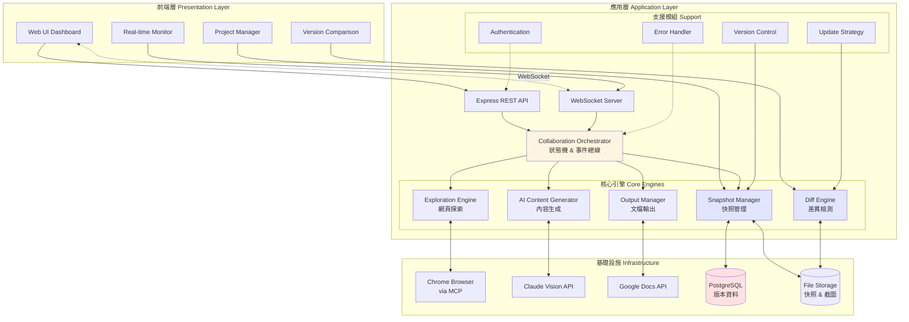
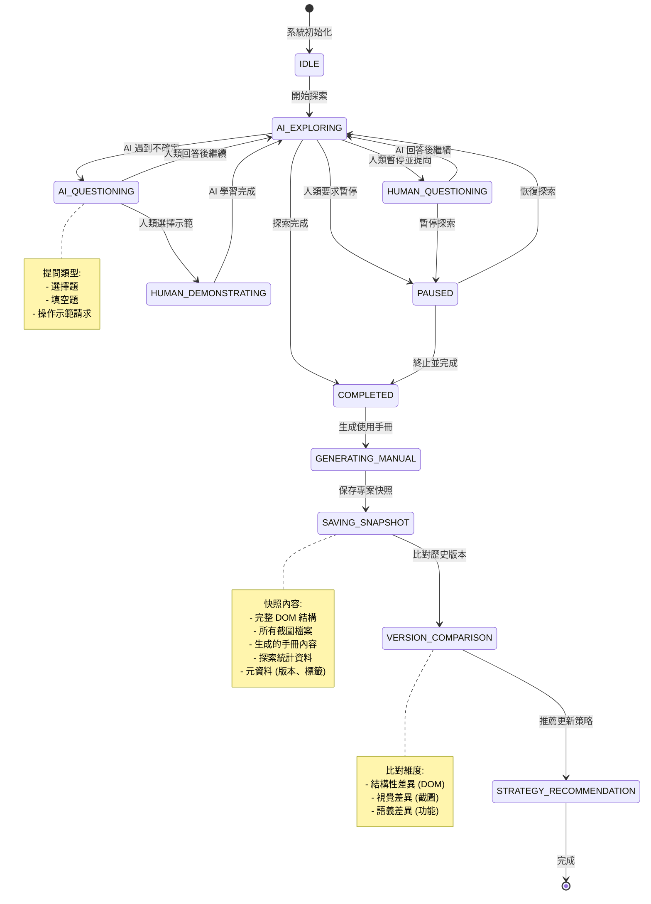
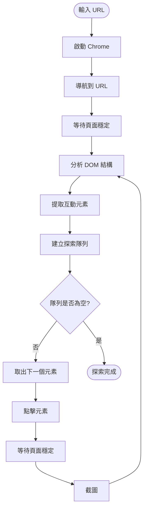
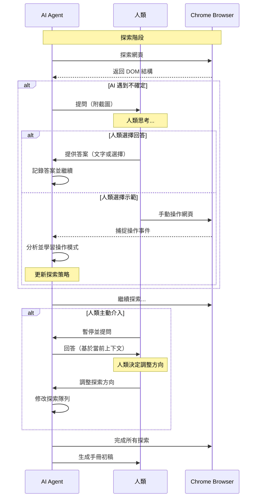
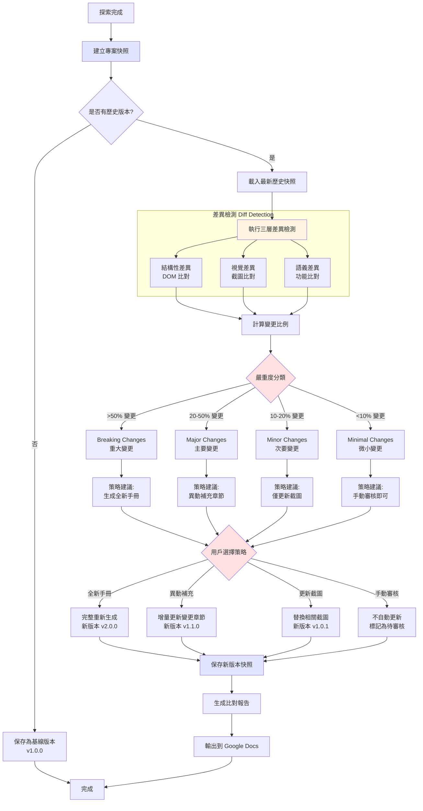
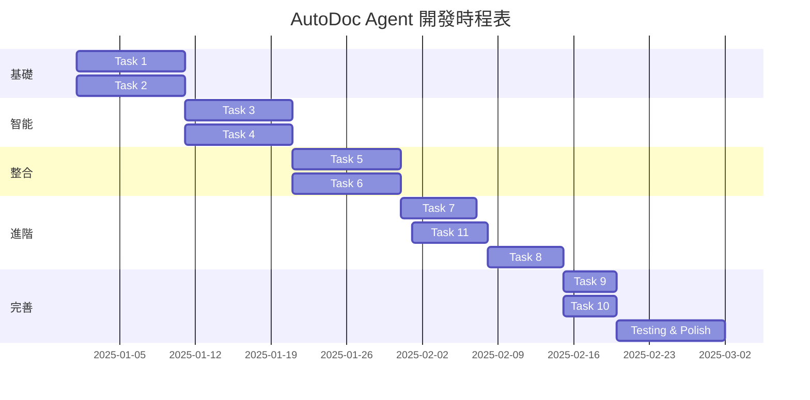

# AutoDoc Agent - Spec-Kit Format Specification (v2.0)

## Overview

這是 AutoDoc Agent 的 Spec-Kit 格式規格文檔，包含治理原則、功能規格、技術計劃和可執行任務。

**版本更新**：
- ✨ 新增：專案存檔與版本比對功能
- 📊 改進：使用 Mermaid 圖表呈現流程和架構
- 🔄 優化：更詳細的差異檢測與更新策略

> **注意**：完整的 Spec-Kit 格式應該分散在多個檔案中（.specify/memory/），此文檔為方便閱讀合併為單一檔案。

---

# 1. Constitution (治理原則)

## Project Identity

**名稱**: AutoDoc Agent  
**版本**: 2.0  
**目標**: 透過 AI 與人類的雙向協作學習，實現零配置的智能網頁探索與使用手冊自動生成。支援完整的專案存檔、版本比對與智能更新策略。

## Core Values

1. **Human-AI Collaboration**: AI 是人類的協作夥伴，不是取代者
2. **Zero Configuration**: 最小化用戶的前期配置工作
3. **Incremental & Reversible**: 所有變更都可審核、可回溯
4. **Version Control**: 完整記錄每次探索，支援跨版本比對
5. **Intelligent Updates**: 根據差異程度推薦最佳更新策略
6. **Reliability**: 在不理想條件下仍能穩定運行
7. **Privacy & Security**: 保護用戶的敏感資訊

## Success Criteria

- 手冊生成時間從 2-3 週縮短至 4-8 小時
- AI 生成內容準確率 > 90%
- 更新頻率提升至每次發版自動更新
- API 成本 < $50/份手冊
- **差異檢測準確率 > 90%**
- **版本比對耗時 < 5 分鐘（100 頁規模）**

## Technology Choices

- **Backend**: Node.js 20+ with TypeScript
- **Browser Control**: Chrome DevTools Protocol via MCP
- **AI**: Anthropic Claude API (Sonnet 4)
- **Output**: Google Docs API
- **Database**: PostgreSQL 14+ (版本管理)
- **Storage**: File System / S3 / Google Cloud Storage
- **Frontend**: React 18 + TypeScript + Tailwind CSS

---

## System Architecture

### 整體架構圖



### 協作狀態機



---

# 2. Specify (功能規格)

## Feature 1: Core Exploration (核心探索)

### What
自動分析網頁結構、規劃探索路徑並執行導航。

### Why
使用者無需撰寫爬蟲腳本或預先定義網站結構，只需輸入 URL 即可開始。

### User Stories
- **US-1**: 輸入 URL 後自動開始探索
- **US-2**: 智能決定探索順序（重要性優先）
- **US-3**: 處理動態載入內容（AJAX）

### Flow Diagram



### Acceptance Criteria
- ✅ 能識別所有主要功能入口（按鈕、連結、選單）
- ✅ 能處理動態載入（等待網路閒置）
- ✅ 探索深度至少 3 層
- ✅ 去重率 > 95%

---

## Feature 2: Bidirectional Collaboration (雙向協作)

### What
AI 與人類的雙向學習：AI 可提問、人類可示範；人類可暫停、提問、調整方向。

### Why
複雜介面無法完全自動化，需要人類知識來輔助 AI 決策。

### User Stories
- **US-4**: AI 遇到不確定時主動提問
- **US-5**: 人類可示範操作給 AI 學習
- **US-6**: 人類可隨時暫停並提問
- **US-7**: 人類可調整探索方向

### Interaction Flow



### Acceptance Criteria
- ✅ AI 能準確描述問題並提問
- ✅ 人類可透過文字或操作回答
- ✅ AI 能觀察並學習人類操作（記錄至少 5 種模式）
- ✅ 人類調整方向後，AI 立即修改探索隊列

---

## Feature 3: Content Generation (內容生成)

### What
使用 Claude Vision API 理解截圖內容，生成結構化的使用手冊文字。

### Why
將視覺資訊轉換為文字說明，是使用手冊的核心價值。

### User Stories
- **US-8**: 為每個功能生成：名稱、用途、步驟、截圖
- **US-9**: 識別警告與注意事項
- **US-10**: 去除重複內容

### Acceptance Criteria
- ✅ 每個功能都有至少 1 張標記截圖
- ✅ 操作步驟清晰（1. 2. 3. 格式）
- ✅ 內容去重率 > 90%
- ✅ 專業術語一致性 > 95%

---

## Feature 4: Google Docs Output (輸出整合)

### What
將生成的內容輸出到 Google Docs，支援修訂模式讓人類審核。

### Why
Google Docs 是企業常用的協作工具，修訂模式允許人類決定接受/拒絕 AI 的建議。

### User Stories
- **US-11**: 建立 Google Docs 文檔並取得分享連結
- **US-12**: 以修訂模式插入內容
- **US-13**: 插入截圖（帶標題）
- **US-14**: 自動生成目錄

### Acceptance Criteria
- ✅ 成功建立文檔並取得連結
- ✅ 正確插入截圖（帶編號）
- ✅ 正確套用格式（標題、粗體、列表）
- ✅ 自動生成目錄

---

## Feature 5: Incremental Updates (增量更新)

### What
檢測產品介面的變更，自動更新使用手冊中過時的內容。

### Why
避免全量重新生成（耗時且會覆蓋人類修改），只更新變更部分。

### User Stories
- **US-15**: 檢測介面變更（新增/刪除/修改元素）
- **US-16**: 只更新變更章節
- **US-17**: 生成變更報告

### Acceptance Criteria
- ✅ 檢測出至少 3 種變更類型
- ✅ 截圖對比準確率 > 90%
- ✅ 只更新變更章節
- ✅ 在 Google Docs 中標記變更

---

## Feature 6: Multi-Variant Management (多機種管理)

### What
支援不同產品版本的獨立手冊管理，共享通用部分。

### Why
企業通常有多個產品版本，共用章節可減少維護成本。

### User Stories
- **US-18**: 配置多個機種
- **US-19**: 識別共用功能
- **US-20**: 生成機種專屬手冊
- **US-21**: 更新共用章節時自動同步

### Acceptance Criteria
- ✅ 支援至少 3 個機種
- ✅ 識別共用功能準確率 > 85%
- ✅ 生成專屬手冊（含共用章節連結）
- ✅ 更新共用章節自動同步

---

## Feature 7: Project Snapshot & Comparison ⭐ **新功能**

### What
完整保存每次探索的專案快照，支援跨版本比對與智能更新策略推薦。

### Why
產品不斷迭代，需要能快速識別變更並決定是「生成全新手冊」還是「異動補充章節」。

### User Stories

- **US-22**: 探索完成後自動保存專案快照
- **US-23**: 列出所有歷史快照並支援篩選
- **US-24**: 比對兩個版本並生成差異報告
- **US-25**: 根據差異程度推薦更新策略
- **US-26**: 匯出/匯入快照檔案

### Detailed Flow



### Data Structure

```typescript
// 專案快照結構
interface ProjectSnapshot {
  // 基本資訊
  id: string;
  projectName: string;
  version: string; // 語義化版本：Major.Minor.Patch
  entryUrl: string;
  capturedAt: Date;
  
  // 元資料
  metadata: {
    productVersion?: string;    // 產品版本號（如韌體版本）
    variant?: string;           // 機種型號
    environment: 'test' | 'staging' | 'production';
    tags: string[];             // 自定義標籤
    description?: string;       // 版本說明
  };
  
  // 探索資料
  explorationData: {
    totalPages: number;
    exploredUrls: string[];
    navigationTree: NavigationNode;  // 完整導航樹
    pageSnapshots: PageSnapshot[];   // 每頁詳細快照
  };
  
  // 手冊內容
  manualContent: {
    sections: ManualSection[];       // 已生成章節
    screenshots: ScreenshotMetadata[]; // 截圖元資料
    glossary: TerminologyEntry[];    // 術語表
  };
  
  // 統計資料
  statistics: {
    explorationDuration: number;     // 探索耗時（秒）
    aiQuestionsCount: number;        // AI 提問次數
    humanInterventionsCount: number; // 人類介入次數
    pagesWithErrors: string[];       // 錯誤頁面
  };
}

// 頁面快照
interface PageSnapshot {
  url: string;
  title: string;
  domHash: string;                   // DOM 結構 hash
  screenshot: {
    url: string;                     // 儲存路徑
    hash: string;                    // 圖片 hash（用於比對）
    width: number;
    height: number;
    capturedAt: Date;
  };
  interactiveElements: InteractiveElement[]; // 互動元素
  formFields: FormField[];           // 表單欄位
  apiCalls: ApiCall[];               // API 請求記錄
}

// 差異報告
interface DiffReport {
  comparedVersions: {
    oldVersion: string;
    newVersion: string;
    oldCapturedAt: Date;
    newCapturedAt: Date;
  };
  
  // 結構性差異
  structuralDiff: {
    addedPages: string[];
    removedPages: string[];
    modifiedPages: ModifiedPageDiff[];
    changeRate: number; // 0-1
  };
  
  // 視覺差異
  visualDiff: {
    changedScreenshots: VisualDiff[];
    changeRate: number; // 0-1
  };
  
  // 語義差異
  semanticDiff: {
    addedFeatures: Feature[];
    removedFeatures: Feature[];
    modifiedFeatures: ModifiedFeature[];
    changeRate: number; // 0-1
  };
  
  // 嚴重度評估
  severity: {
    structuralChangeRate: number;
    visualChangeRate: number;
    semanticChangeRate: number;
    overallSeverity: 'minimal' | 'minor' | 'moderate' | 'major' | 'breaking';
  };
  
  // 策略建議
  recommendedStrategy: {
    strategy: 'full_regeneration' | 'incremental_update' | 'screenshot_update' | 'manual_review';
    reason: string;
    estimatedTime: string;
    estimatedCost: string;
    affectedChapters?: string[];
  };
  
  // 受影響章節
  affectedSections: {
    sectionId: string;
    sectionTitle: string;
    changeType: 'added' | 'removed' | 'modified';
    changeDescription: string;
  }[];
}
```

### Acceptance Criteria

- ✅ 能完整保存探索快照（DOM、截圖、手冊內容、統計）
- ✅ 快照儲存格式支援壓縮（減少 70% 空間）
- ✅ 支援快照列表查看與篩選（版本、日期、標籤）
- ✅ 三層差異檢測（結構、視覺、語義）準確率 > 90%
- ✅ 能根據差異嚴重度推薦更新策略
- ✅ 生成詳細的差異報告（Markdown/PDF/HTML 格式）
- ✅ 支援快照匯出與匯入（JSON/ZIP 格式）
- ✅ 版本管理支援語義化版本號（Major.Minor.Patch）
- ✅ 版本比對耗時 < 5 分鐘（100 頁規模）

---

# 3. Plan (技術計劃)

## Data Model

### Database Schema

```sql
-- 探索會話
CREATE TABLE exploration_sessions (
  id UUID PRIMARY KEY,
  project_name VARCHAR(255) NOT NULL,
  entry_url VARCHAR(2048) NOT NULL,
  strategy VARCHAR(20) NOT NULL,
  status VARCHAR(20) NOT NULL,
  created_at TIMESTAMP NOT NULL,
  updated_at TIMESTAMP NOT NULL,
  INDEX idx_project_name (project_name),
  INDEX idx_created_at (created_at)
);

-- 專案快照（新增）
CREATE TABLE project_snapshots (
  id UUID PRIMARY KEY,
  session_id UUID REFERENCES exploration_sessions(id) ON DELETE CASCADE,
  project_name VARCHAR(255) NOT NULL,
  version VARCHAR(50) NOT NULL, -- 語義化版本
  captured_at TIMESTAMP NOT NULL,
  metadata JSONB NOT NULL,
  exploration_data JSONB NOT NULL,
  manual_content JSONB NOT NULL,
  statistics JSONB NOT NULL,
  storage_path VARCHAR(1024), -- 快照檔案路徑
  compressed BOOLEAN DEFAULT true,
  size_bytes BIGINT,
  INDEX idx_project_version (project_name, version),
  INDEX idx_captured_at (captured_at),
  UNIQUE (project_name, version)
);

-- 版本比對記錄（新增）
CREATE TABLE version_comparisons (
  id UUID PRIMARY KEY,
  old_snapshot_id UUID REFERENCES project_snapshots(id),
  new_snapshot_id UUID REFERENCES project_snapshots(id),
  diff_report JSONB NOT NULL,
  recommended_strategy VARCHAR(50),
  compared_at TIMESTAMP NOT NULL,
  INDEX idx_snapshots (old_snapshot_id, new_snapshot_id)
);

-- 頁面快照
CREATE TABLE page_snapshots (
  id UUID PRIMARY KEY,
  snapshot_id UUID REFERENCES project_snapshots(id) ON DELETE CASCADE,
  url VARCHAR(2048) NOT NULL,
  title VARCHAR(500),
  dom_hash VARCHAR(64) NOT NULL,
  screenshot_url VARCHAR(1024),
  screenshot_hash VARCHAR(64),
  interactive_elements JSONB,
  captured_at TIMESTAMP NOT NULL,
  INDEX idx_snapshot_url (snapshot_id, url)
);

-- 手冊章節
CREATE TABLE manual_sections (
  id UUID PRIMARY KEY,
  snapshot_id UUID REFERENCES project_snapshots(id) ON DELETE CASCADE,
  title VARCHAR(255) NOT NULL,
  content TEXT NOT NULL,
  order_index INTEGER NOT NULL,
  parent_section_id UUID REFERENCES manual_sections(id),
  created_at TIMESTAMP NOT NULL
);

-- 協作日誌
CREATE TABLE collaboration_logs (
  id UUID PRIMARY KEY,
  session_id UUID REFERENCES exploration_sessions(id) ON DELETE CASCADE,
  type VARCHAR(50) NOT NULL,
  data JSONB NOT NULL,
  timestamp TIMESTAMP NOT NULL,
  INDEX idx_session_type (session_id, type)
);
```

## API Endpoints

### Snapshot Management

```
POST   /api/snapshots                 - 建立新快照
GET    /api/snapshots                 - 列出所有快照（支援篩選）
GET    /api/snapshots/:id             - 獲取快照詳情
DELETE /api/snapshots/:id             - 刪除快照
POST   /api/snapshots/:id/export      - 匯出快照
POST   /api/snapshots/import          - 匯入快照
GET    /api/snapshots/:id/download    - 下載快照檔案
```

### Version Comparison

```
POST   /api/comparisons               - 比對兩個版本
GET    /api/comparisons/:id           - 獲取比對結果
GET    /api/comparisons/:id/report    - 下載比對報告
```

### Update Strategy

```
POST   /api/updates/strategy          - 獲取更新策略建議
POST   /api/updates/execute           - 執行更新策略
GET    /api/updates/status/:id        - 獲取更新狀態
```

## Performance Optimization

### Snapshot Storage Optimization
- **壓縮策略**：使用 gzip 壓縮 JSON 資料（壓縮率 ~70%）
- **分層儲存**：
  - 熱資料（最近 3 個版本）：PostgreSQL + 本地儲存
  - 溫資料（近 6 個月）：S3 Standard
  - 冷資料（>6 個月）：S3 Glacier
- **延遲載入**：大型快照分段載入（按需載取頁面快照）

### Diff Engine Optimization
- **並行比對**：結構、視覺、語義三層並行處理
- **快取機制**：相同版本的比對結果快取 24 小時
- **增量比對**：只比對變更的頁面，跳過相同頁面

---

# 4. Tasks (可執行任務)

## Task Overview



## Task 11: Project Snapshot & Comparison System ⭐

**Priority**: High  
**Complexity**: Medium-High  
**Estimated Time**: 7 days

### Files to Create

```
backend/src/snapshot/
├── snapshot_schema.ts          - 快照資料結構定義
├── snapshot_storage.ts         - 快照儲存管理
├── diff_engine.ts              - 差異檢測引擎
├── update_strategy.ts          - 更新策略決策
├── version_manager.ts          - 版本管理
├── report_generator.ts         - 比對報告生成
└── import_export.ts            - 匯出/匯入功能

frontend/src/components/
├── ProjectManager.tsx          - 專案管理介面
├── SnapshotList.tsx           - 快照列表
├── VersionComparison.tsx      - 版本比對介面
├── DiffViewer.tsx             - 差異查看器
└── StrategySelector.tsx       - 策略選擇對話框
```

### Subtasks

1. **設計快照資料結構** (1 day)
   - 定義 TypeScript 介面
   - 設計資料庫 Schema
   - 實作序列化/反序列化

2. **實作快照儲存** (1.5 days)
   - 保存/載入快照
   - 壓縮/解壓縮
   - 檔案系統操作
   - 資料庫操作

3. **開發差異檢測引擎** (2 days)
   - DOM 結構比對
   - 截圖視覺比對（pixelmatch）
   - 語義差異分析（Claude API）

4. **建立策略決策引擎** (1 day)
   - 計算變更嚴重度
   - 生成策略建議
   - 成本預估

5. **實作版本管理** (0.5 day)
   - 語義化版本號
   - 版本標籤
   - 版本搜尋

6. **生成比對報告** (1 day)
   - Markdown 報告
   - PDF 報告
   - HTML 報告
   - 差異視覺化

7. **建立前端 UI** (1 day)
   - 專案管理介面
   - 版本比對介面
   - 策略選擇對話框

### Testing

**Unit Tests**:
- 快照序列化/反序列化
- DOM diff 演算法
- 版本號自動遞增

**Integration Tests**:
- 完整快照保存與載入
- 兩個版本的完整比對
- 策略推薦準確性

**E2E Tests**:
- 場景：保存基線版本 → 修改網站 → 比對差異 → 生成報告

---

## Implementation Timeline (Updated)

### Phase 1: Foundation (Week 1-2)
- Task 1: Browser Control via MCP
- Task 2: Exploration Engine
- **Milestone**: 能自動探索簡單網站並截圖

### Phase 2: Intelligence (Week 3-4)
- Task 3: Collaboration System
- Task 4: AI Content Generation
- **Milestone**: 能生成基本手冊並支援人機協作

### Phase 3: Integration (Week 5-6)
- Task 5: Google Docs Output
- Task 6: Frontend UI
- **Milestone**: 端對端工作原型

### Phase 4: Advanced Features (Week 7-8)
- Task 7: Incremental Updates
- **Task 11: Snapshot & Comparison** ⭐
- Task 8: Multi-Variant Management
- **Milestone**: 完整的版本管理與智能更新

### Phase 5: Production Ready (Week 9-10)
- Task 9: Authentication & Security
- Task 10: Error Handling & Monitoring
- Comprehensive Testing
- Documentation
- **Milestone**: Version 2.0 Release

---

## Next Steps

### Immediate Actions

1. **環境設定**
   ```bash
   # 安裝依賴
   npm install pixelmatch sharp archiver
   npm install @types/archiver --save-dev
   
   # 更新資料庫 Schema
   psql -U user -d autodoc < database/migrations/add_snapshots.sql
   ```

2. **開始實作 Task 11**
   - 從 `snapshot_schema.ts` 開始
   - 逐步實作其他模組
   - 編寫單元測試

3. **測試策略**
   - 準備兩個版本的測試網站
   - 驗證差異檢測準確性

---

## Risk Assessment

| 風險 | 機率 | 影響 | 緩解措施 |
|------|------|------|----------|
| 快照檔案過大 | High | Medium | 實作壓縮與分層儲存 |
| 差異檢測不準確 | Medium | High | 使用多層檢測 + 人工審核 |
| 版本比對耗時過長 | Medium | Medium | 並行處理 + 快取 + 增量比對 |
| 儲存成本高 | Low | Medium | 冷儲存遷移 + 定期清理 |

---

**Document Version**: 2.0  
**Generated by**: SmartSpec (Claude Sonnet 4)  
**Date**: 2025-11-10  
**Updates**: 新增專案存檔與比對功能、Mermaid 圖表
